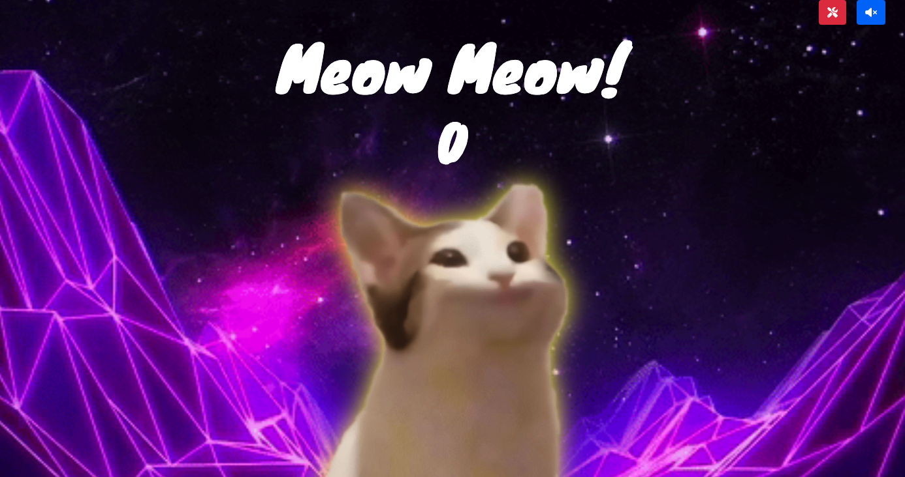

# Space Cat
Learning project trying to copy the popular [POPCAT](https://popcat.click/), click [Github Page](https://klu0926.github.io/ac-space-cat/) here

## Screenshot

## Features
- `meow` click to make the cat meow! (audio default off)
- `audio` click screen top right to turn on/off audio
- `score` click to increase your score
- `customize` allow user to upload file to change a few things:
  - `title` the giant white text on the screen
  - `image1` the default cat image
  - `image2` the image when user click on the screen
  - `background` the background image (best with animated gif)
  - `sound` switch sound that play when user click the screen
  - `BGM` BGM